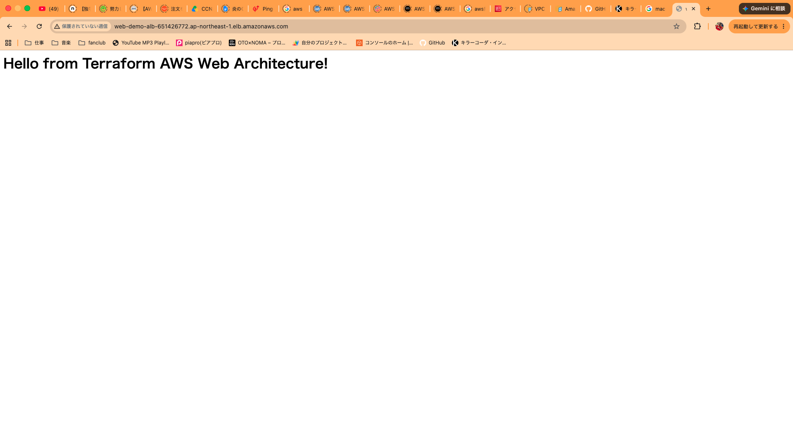

# AWS 2-Tier Web Architecture with Terraform

AWS上に冗長性とセキュリティを考慮したWebインフラ基盤をTerraformでコード化したリポジトリです。
手動構築による属人化を排除し、コマンド操作のみで完全なインフラ環境を再現（IaC）できるように設計しています。

---

## 動作確認

## 1. システム構成・アーキテクチャ

* **ネットワーク (VPC / Subnet)**
  * 2つのアベイラビリティーゾーン（\`ap-northeast-1a\`, \`ap-northeast-1c\`）にパブリックサブネットを分散配置。
  * ALBの冗長配置要件に対応した高可用性ネットワーク構成。
* **ロードバランサー (ALB)**
  * インターネットからのHTTP通信を受け付け、配下のWebサーバーへ転送。
  * ヘルスチェックによる死活監視を実施。
* **コンピュート (EC2 / Nginx)**
  * Amazon Linux 2023 を採用。
  * \`User Data\` スクリプトにより、インスタンス起動時にNginxを自動インストール・起動。
* **セキュリティ (Security Group)**
  * ALB: \`0.0.0.0/0\` からのHTTP(80)を許可。
  * EC2: 送信元を「ALBのセキュリティグループID」に限定し、インターネットからの直接アクセスを遮断（多層防御）。

---

## 2. 設計の工夫・こだわり

1. **多層防御によるアクセス制御**
   Webサーバー（EC2）がパブリックサブネット内に存在しながらも、セキュリティグループの連動により「ALB経由のアクセスのみ」に限定して安全性を高めています。
2. **保守性を意識したファイル分割**
   単一の \`main.tf\` に詰め込まず、「ネットワーク」「セキュリティ」「コンピュート/LB」と責務ごとに対象ファイルを分離しています。
3. **最新AMIの動的取得**
   AMI IDを固定コードにせず、\`data\` ソースを用いて公式の最新Amazon Linux 2023を動的に参照するようにしています。

---

## 3. ファイル構成

\`\`\`text
├── .gitignore               # 機密情報・キャッシュの除外設定
├── README.md                # 本ドキュメント
├── main.tf                  # プロバイダー、EC2、ALBの定義
├── network.tf               # VPC、サブネット、ルーティングの定義
├── security.tf              # セキュリティグループの定義
├── variables.tf             # 変数の定義
├── outputs.tf               # 構築後の出力値（ALB DNS名）
└── terraform.tfvars.example  # 設定値のサンプル
\`\`\`

---

## 4. デプロイ手順

### 前提条件
* Terraform >= 1.5.0
* AWS CLI の認証設定（\`aws configure\` 完了済み）

### 実行手順
\`\`\`bash
# 1. リポジトリのクローン
git clone <リポジトリURL>
cd aws-terraform-web-infra

# 2. 初期化
terraform init

# 3. 構築プランの確認
terraform plan

# 4. インフラの構築
terraform apply
\`\`\`

構築完了後、コンソールに表示される \`alb_dns_name\` のURLにブラウザからアクセスすると、Nginxの画面が表示されます。

### リソースの破棄
\`\`\`bash
# 検証終了後のリソース一括削除
terraform destroy
\`\`\`
